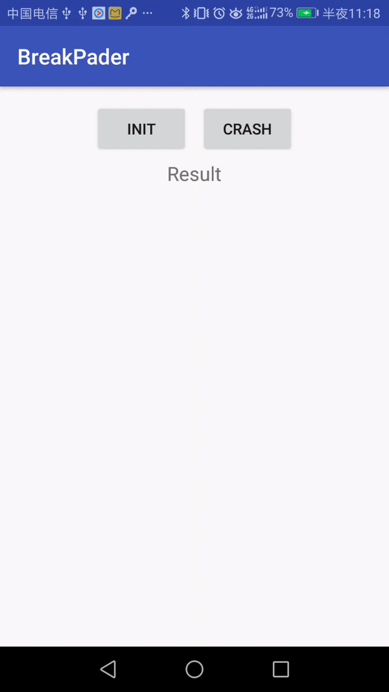

## BreakPader
[](https://raw.githubusercontent.com/TheoTian/BreakPader/master/LICENSE)
[]()

The wrapper of google's famous project Breakpad. Use a simple way to help developer to quick import.

## Getting started
See the demo code.

#### 1.Construct Breakpader instance in your Application class.

```
public class MyApplication extends Application {

    private static Breakpader sBreakpaderInstance;

    @Override
    public void onCreate() {
        super.onCreate();
        //new the instance and set the root directory to dump
        sBreakpaderInstance = new Breakpader(getExternalCacheDir() + "/breakpader/");
    }

    public static Breakpader getBreakpader() {
        return sBreakpaderInstance;
    }
}
```
#### 2.Init Breakpader

Start to observe the application crash fatal signal.

```
//you can call this method on the sub thread.
MyApplication.getBreakpader().init();
``` 

#### 3.Symbol Libs
```
MyApplication.getBreakpader().symbol(new File(MainActivity.this.getApplicationInfo().dataDir + "/lib/").listFiles());
```

#### 4.Translate Crash Dump File
```
ProcessResult processResult = MyApplication.getBreakpader().translate(crashFilePath);
```

## Support
Any problem?

Welcome to contact me for help.


## License
Tinker is under the Apache License 2.0. See the [LICENSE](https://raw.githubusercontent.com/TheoTian/BreakPader/master/LICENSE) file for details.

## Preview


